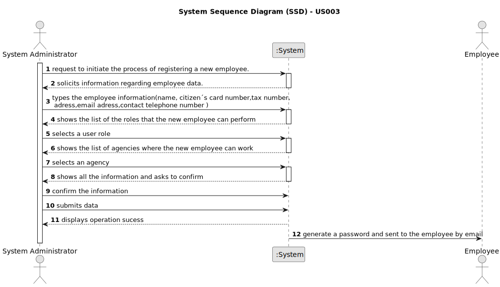

# US 003

## 1. Requirements Engineering

### 1.1. User Story Description

As a system administrator, I want to register a new employee.

### 1.2. Customer Specifications and Clarifications

**From the specifications document:**

> The company´s systems administrator will be responsible for registering all employees (specifying the name, the citzen´s card number, the tax number, the adress, the email adress, the contact telephone number and the agency to which it is assigned).

**From the client clarifications:**

> **Question:** When registering a new employee, will the administrator set the respective employee password?
>
> **Answer:** The password should have eight characters in length and should be generated automatically. The password is sent to the employee by e-mail.

> **Question:** Does the System Administrator have permission to create, edit, delete, or just create new employee registrations?
>
> **Answer:** For now, the System Administrator can only do what is specified in the Project Requirements.

> **Question:** Can an employee be registered to more than one agency?
>
> **Answer:** No.

> **Question:** What would be the attributes of the System Administrator, Agency and the Roles?
>
> **Answer:** The System Administrator is an employee. You can get the roles from the project description.
Moreover, I just answered a question to clarify what are the attributes of an agency/store.

> **Question:** The administrator when registering a new employee will also have to specify the category/office that he will perfom (for example agent, store manager, store network manager)?
>
> **Answer:** The administrator has to specify the role of the employee.

> **Question:** Does the system administrator select the agency to which the employee is assigned and his role from a list? Or does he just type that data?
>
> **Answer:** The System Administrator should select.

> **Question:** The administrator when registering a new employee will also have to specify the category/office that he will perfom (for example agent, store manager, store network manager)?
>
> **Answer:** The administrator has to specify the role of the employee.

> **Question:** What would be the attributes of the System Administrator, Agency and the Roles?
>
> **Answer:** The System Administrator is an employee. You can get the roles from the project description. Please check the project description.
Moreover, I just answered a question to clarify what are the attributes of an agency/store.

> **Question:** Can an employee be registered to more than one agency?
>
> **Answer:** No.

> **Question** Does the System Administrator have permission to create, edit, delete, or just create new employee registrations?
>
>  **Answer:** For now, the System Administrator can only do what is specified in the Project Requirements.

> **Queston:** When registering a new employee, will the administrator set the respective employee password?
>
> **Answer:** The password should have eight characters in length and should be generated automatically. The password is sent to the employee by e-mail.

> **Question:** The system administrator cannot add an agent that already exists, the agent has two unique numbers that identify him (Tax number and Citizen's card number) which one should be used to identify the agent?
>
> **Answer:** The tax number.

> **Question** Must the Tax number and Citizen's card number follow any convention? If so, which?
>
> **Answer:** You should use the tax identification number used for tax purposes in the US.

> **Question:** Does the system administrator select the agency to which the employee is assigned and his role from a list? Or does he just type that data?
>
> **Answer:** The System Administrator should select.

> **Question:** However, it was replied to a question when a new Employee is created in the system, that a 8 digit Password should be automatically generated. How many digits should we go forward for password length validation in your software? And please confirm required special characters, etc.
>
> **Answer:** Sorry, I completely forgot that all our authentication systems require passwords with seven alphanumeric characters in length , including three capital letters and two digits. The password should be generated automatically. The password is sent to the employee by e-mail.

> **Question:** When registering a new employee, all the required data (name, citizen's card number, etc...) have to be filled or exists not mandatory data?
>
> **Answer:** Required/Mandatory data that should be filled when registering an employee: name, the citizen's card number, the tax number, the email address, the contact telephone number and the agency to which it is assigned.

> **Question:** You have stated before that name, cc number, tax number, email address, phone number and the assigned agency of the employee are the mandatory requirements to register a new one, leaving out the employee's adress and role. This confused me, because it wasn't clear whether leaving out those two characteristics from the answer was intentional or not. Futhermore, the role of the employee seems like too much of an important piece of information to be left out. My request is, then, for you to state whether or not that was a conscious decision in your answer.
>
> **Answer:** The role is required.

> **Question:** I have a question related to the output data: when the system administrator is registering a new employee are we free to display what we feel is important or should a specific message be shown? I was thinking of displaying whether the operation was successful or not, is that fine or should something else be displayed as well?
>
> **Answer:** A good pratice is to show the information and ask for confirmation.

> **Question:** When registering employees does the administrator selects a role for them?
>
> **Answer:** Yes.

> **Question** According to the statement, the administrator has to clarify the citizen's card number, but what card is it? In the US, there is no identification card, so is it referring to the passport?
> 
> **Answer** You are correct. The citizen card number should be replaced by the passport card number.

### 1.3. Acceptance Criteria

* **AC1:** The system administrator must select the role and the agency assigned to the new employee.
* **AC2:** The number that identifies an employee is the tax number.
* **AC3:** The system administrator must fill all the information about the new employee.
* **AC4:** A password of seven alphanumeric characters, including three capital letters and two digits is automatically generated and sent by email.

### 1.4. Found out Dependencies

* There is no dependencies in this user story.

### 1.5 Input and Output Data

**Input Data:**

* Typed data:
	* name,
	* passport card number,
	* tax number,
	* adress
	* email adress,
	* telephone number.

* Selected data:
* Roles that the new employee can perform.
* Assign an agency to the new employee.

**Output Data:**

* A password of seven alphanumeric characters in lenght, including three capital letters and two digits should be generated automatically and sent to the employee by email.
* (In)Success of the operation

### 1.6. System Sequence Diagram (SSD)

**Other alternatives might exist.**

#### Alternative One

### 1.7 Other Relevant Remarks

