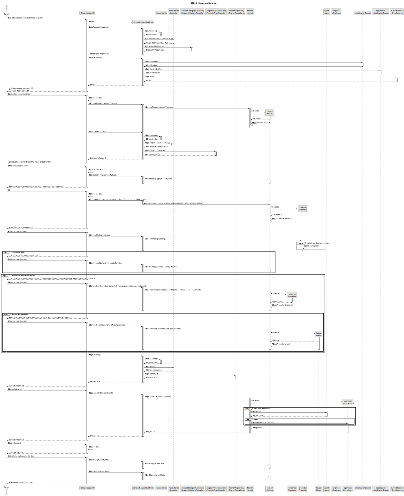
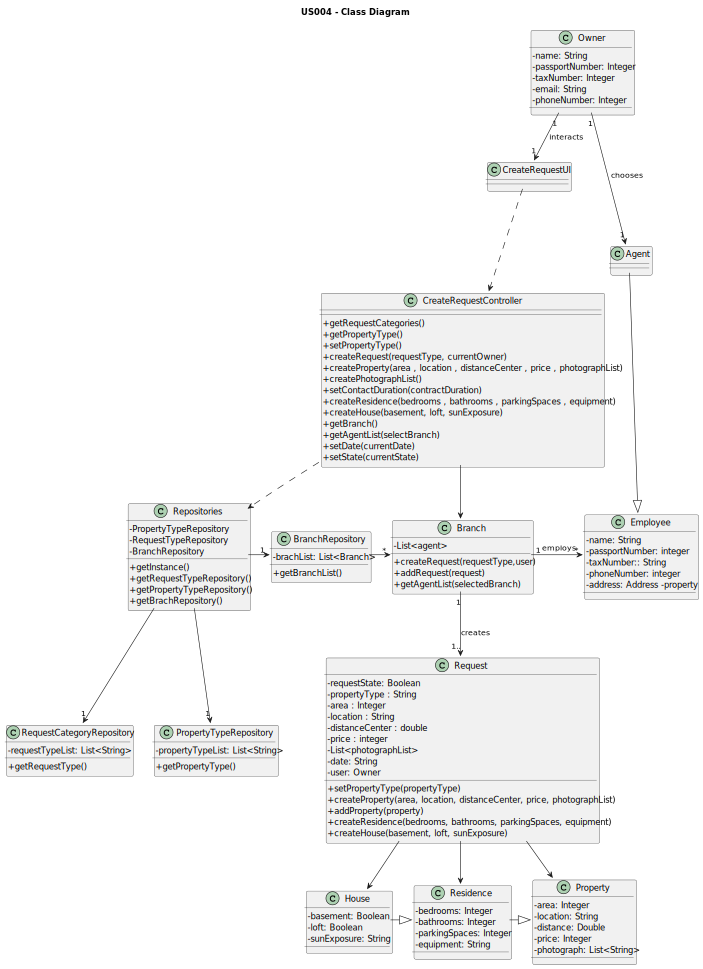

# US 006 - To create a Reqeust and choosing an agent

## 3. Design - User Story Realization 

### 3.1. Rationale

**SSD - is adopted.**

| Interaction ID | Question: Which class is responsible for...                                                                         | Answer                    | Justification (with patterns)                                                                                 |
|:---------------|:--------------------------------------------------------------------------------------------------------------------|:--------------------------|:--------------------------------------------------------------------------------------------------------------|
| Step 1  		     | 	... interacting with the actor?                                                                                    | CreateRequestUI           | Pure Fabrication: there is no reason to assign this responsibility to any existing class in the Domain Model. |
| 			  		        | 	... coordinating the US?                                                                                           | CreateRequestController   | Controller                                                                                                    |
| 			  		        | 	... retriveing the types of contract                                                                               | RequestCategoryRepository | IE: it has the necessary knowledge to get the contract types                                                  |
| 	  		          | ... displaying the types of contract and requesting information related to the contract	                            | CreateRequestUI           | 	IE: it is responsible for user interactions                                                                  |
| Step 2 		      | 	... retrieving the types of property                                                                               | PropertyTypeRepository    | IE: it has the necessary knowledge to get the property typesIE: object created in step 1 has its own data.    |
|                | .. displaying the types of property and requesting information related to the property                              | CreateRequestUI           | IE: it is responsible for user interactions                                                                   |
| Step 3 		      | 	...requesting the data regarding the property type                                                                 | CreateRequestUI           | IE: it is responsible for user interactions                                                                   |
|                | ... creating a property                                                                                             | Property                  | Creator: it has the responsibility of creating a Property object                                              |
| Step 4	        | 	... ...requesting information related to the property location , distance from center , photos and requested price | CreateRequestUI           | IE: it is responsible for user interactions                                                                   |
|                | ... saving the data                                                                                                 | CreateRequestUI           | IE: it is responsible for saving the inputed data                                                             |
| Step 5		       | ... creating the request							                                                                                     | Request                   | Creator: it has the responsability of creating a request object                                               |              
| Step 6         | ...retriveing the agent list                                                                                        | BranchRepository          | IE: it has the necessary knowledge to get the agent list                                                      |
|                | ...displaying the agent list                                                                                        | CreateRequestUI           | IE: it is responsible for user interactions                                                                   |
| Step 7  		     | choosing an agent                                                                                                   | CreateRequestUI           | IE: it is responsible for user interactions                                                                   | 
|                | ...saving the data                                                                                                  | CreateRequestUI           | IE: it is responsible for saving the data                                                                     |
| Step 8  		     | 	... informing operation success?                                                                                   | CreateRequestUI           | IE: is responsible for user interactions.                                                                     | 

### Systematization ##

According to the taken rationale, the conceptual classes promoted to software classes are: 

 * Request
 * Property

Other software classes (i.e. Pure Fabrication) identified: 

 * CreateRequestUI  
 * CreateRequestController

## 3.2. Sequence Diagram (SD)

###  Full Diagram

This diagram shows the full sequence of interactions between the classes involved in the realization of this user story.

## 3.3. Class Diagram (CD)

