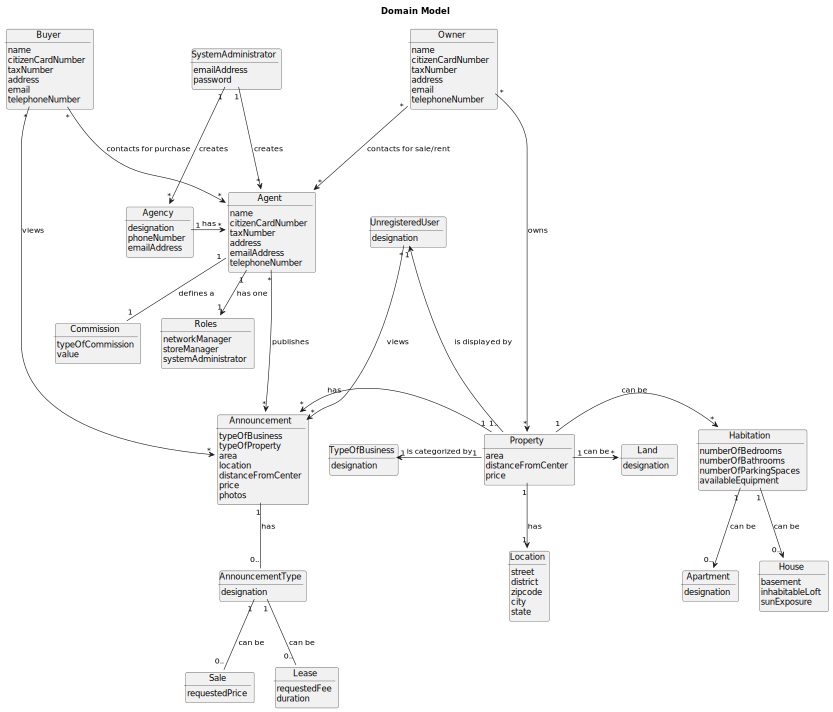

# Analysis

The construction process of the domain model is based on the client specifications, especially the nouns (for _concepts_) and verbs (for _relations_) used. 

## Rationale to identify domain conceptual classes ##
To identify domain conceptual classes, start by making a list of candidate conceptual classes inspired by the list of categories suggested in the book "Applying UML and Patterns: An Introduction to Object-Oriented Analysis and Design and Iterative Development". 

### _Conceptual Class Category List_ ###

**Business Transactions**

* Buy 
* Sell 
* Rent Properties (house, apartment, land). 
* Payment

---

**Transaction Line Itemss**

* Published Property

---

**Product/Service related to a Transaction or Transaction Line Item**

*  Easily be able to buy / rent / sell properties.

---

**Transaction Records**

* For a Sale Order:
* Inputs:
* Property information (price, address, etc.)
* Property Owner information (name, tax number, etc.)
* Outputs:
* Sale Order (with the property information)
* Sale Order Published Date 
* For a Scheduled Visit:
* Inputs:
* Property information (price, address, etc.)
* Property Owner information (name, tax number, etc.)
* Buyer information (name, tax number, etc.)
* Outputs:
* Visit Order (with the property information)
* Visit Order Schedule Date 
* For an Offer:
* Inputs:
* Property information (price, address, etc.)
* Property Owner information (name, tax number, etc.)
* Buyer information (name, tax number, etc.)

---  

**Roles of People or Organizations**

* Owner : Sell the property. 
* Buyer : Buy a property. 
* Agent : Broker for the sale / purchase / rent of properties. 
* Agency : Contain ads in the system. 
* Store Network Manager : Manage the network of all stores. 
* Store Manager : Manage a store. 
* System Administrator : Set roles to employees and keeps the system running smoothly. 
* Unregistered User
* Real Estate USA: company that owns a network of real estate agencies;
---

**Places**

*  Agency 
* Property

---

**Noteworthy Events**

* User Registration
* User Login/Logout
* User Profile Update (Agent to Store Manager)
* User Profile Update (Store Manager to Store Network Manager)
* Filter and Sort
* Agency Creation
* Agency Update
* Agency Deletion
* Sale/Rent Order Creation/Update/Deletion
* Visit Order Creation/Update/Deletion\
* Offer Creation/Update/Deletion
---

**Physical Objects**

* Agency 
* Property (House, apartment, land)

---

**Descriptions of Things**

*  

---

**Catalogs**

*  List of properties.

---

**Containers**

*
---

**Elements of Containers**

*
---

**Organizations**

*  Real Estate USA.

---
**Other External/Collaborating Systems**

*  

---

**Records of finance, work, contracts, legal matters**

* 

---

**Financial Instruments**

*  

---

**Documents mentioned/used to perform some work/**

* 
---

###**Rationale to identify associations between conceptual classes**###

| Concept (A) 		            |  Association   	            |  Concept (B)                  |
| Store Network Manager	   		|  manages		                |agency                         |
| Agency  	                    |  has managed by 		 	    | agent store manager           |            
| System Administrator  	    |  creates    		 	            | ...                           |
| Property Owner                | upadtes
| Buyer                         |
| Unregistered User             |
| Agent                         |

| **_Concep (A)_**          | **_Association_**                              | **_Concep (B)_**                              |
|:--------------------------|:-----------------------------------------------|-----------------------------------------------|
| **Store Network Manager** | Manages                                        | Agency                                        |
| **Agency**                | Has managed by                                 | Agent, Store Manager                          |
| **System Administrator**  | Created and updates                            | Agent, agency                                 |
| **Property Owner**        | owns contacts for Sale/Rent                    | Property, agency                              |
| **Buyer**                 | views, sorts and filters contacts for Purchase | Published Property, Published Property, Agent |
| **Unregister User**       | views, sorts and filters                       | Published Property, Published Property        |
| **Agent**                 | publishes                                      | Property                                      |

## Domain Model

