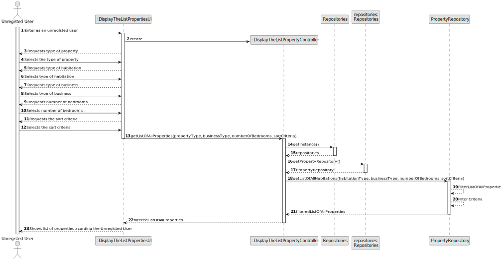
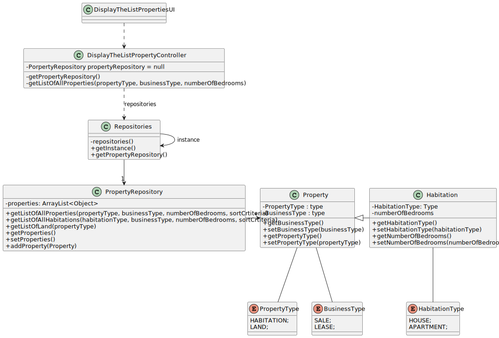

# US 001 - To create a Task 

## 3. Design - User Story Realization 

### 3.1. Rationale

**SSD - Alternative 1 is adopted.**

| Interaction ID                                  | Question: Which class is responsible for...       | Answer                           | Justification (with patterns)                                                                                 |
|:------------------------------------------------|:--------------------------------------------------|:---------------------------------|:--------------------------------------------------------------------------------------------------------------|
| Step 1  	 Display properties                    | 	... instantiating the class that handles the UI  | DisplayTheListPropertyUI         | Pure Fabrication: there is no reason to assign this responsibility to any existing class in the Domain Model. |
| 			  		                                         | ... interacting with the actor?                   | DisplayTheListPropertyUI         | Pure Fabrication: there is no reason to assign this responsibility to any existing class in the Domain Model. |
| 			  		                                         | ... coordinating the US?                          | DisplayTheListPropertyController | Controller                                                                                                    |
| 			  		                                         | ... knowing the user using the system?            | UserSession                      | IE: cf. A&A component documentation.                                                                          |
| 			  		                                         | ...displaying the UI for the user input Data?				 | DisplayTheListPropertyUI         | IE: is responsible for user interactions                                                                      |
| 			  		                                         | ...temporarily keeping the input Data?			         | DisplayTheListPropertyUI         | IE: is responsible for user interactions                                                                      |
| 			  		                                         | ... getting the propertyRepository                | Repositories                     | IE: is responsible for saving all repositories                                                                |
| 			  		                                         | ...validating input data?					                    | DislayTheListPropertyUI          | IE: is responsible for user interactions                                                                      |
| Step 2  	Requests the type of property	         | 	...requests the type of habitation?					         | DisplayTheListPropertyUI         | Pure Fabrication: there is no reason to assign this responsibility to any existing class in the Domain Model. |
| Step 3   Selects the type of property           | 	... saves the type of habitation?                | DisplayTheListPropertyUI         | Pure Fabrication: there is no reason to assign this responsibility to any existing class in the Domain Model. |
| Step 4   Requests the type of habitation        | 	...requests the type of habitation?              | DisplayTheListPropertyUI         | Pure Fabrication: there is no reason to assign this responsibility to any existing class in the Domain Model. |
| Step 5   Selects the type of habitation         | 	...saves the type of habitation ?                | DisplayTheListPropertyUI         | Pure Fabrication: there is no reason to assign this responsibility to any existing class in the Domain Model. |
| Step 6  	Requests type of business              | 	...requests the type of business?						          | DisplayTheListPropertyUI         | Pure Fabrication: there is no reason to assign this responsibility to any existing class in the Domain Model. |              
| Step 7  	Selects  the type of business	         | 	... saves the type of business?                  | DisplayTheListPropertyUI         | Pure Fabrication: there is no reason to assign this responsibility to any existing class in the Domain Model. | 
| Step 8	Requests number of bedrooms	  		         | 	... requests the number of bedrooms?             | DisplayTheListPropertyUI         | Pure Fabrication: there is no reason to assign this responsibility to any existing class in the Domain Model. | 
| Step 9	Selects the number of bedrooms           | 	... saves the number of bedrooms?                | DisplayTheListPropertyUI         | Pure Fabrication: there is no reason to assign this responsibility to any existing class in the Domain Model. | 
| Step 10  Requests the sort criteria		           | 	... requests the sort criteria                   | DisplayTheListPropertyUI         | Pure Fabrication: there is no reason to assign this responsibility to any existing class in the Domain Model. | 
| Step 11  Selects the sort criteria		            | 	... saves the sort criteria?                     | DisplayTheListPropertyUI         | Pure Fabrication: there is no reason to assign this responsibility to any existing class in the Domain Model. | 
| 		                                              | 	... filter the properties to display?            | PropertyRepository               | IE: knows the list of properties                                                                              | 
| 		                                              | 	... update the list with the sort criteria?      | PropertyRepository                       | IE: knows the list of properties                                                                      | 
| Step 12 Shows the list of matching properties		 | 	... display the list of properties?              | PropertyRepository                      | IE: is responsible for user interactions.                                                                     | 

### Systematization ##

According to the taken rationale, the conceptual classes promoted to software classes are: 

 * Repositories
 * PropertyRepositories

Other software classes (i.e. Pure Fabrication and controller) identified: 

 * DisplayTheListPropertiesUI - (Pure Fabrication: there is no reason to assign this responsibility to any existing class in the Domain Model.)
 * DisplayTheListPropertyController - (Controller)

## 3.2. Sequence Diagram (SD)

### Alternative 1 - Full Diagram

This diagram shows the full sequence of interactions between the classes involved in the realization of this user story.

## 3.3. Class Diagram (CD)

