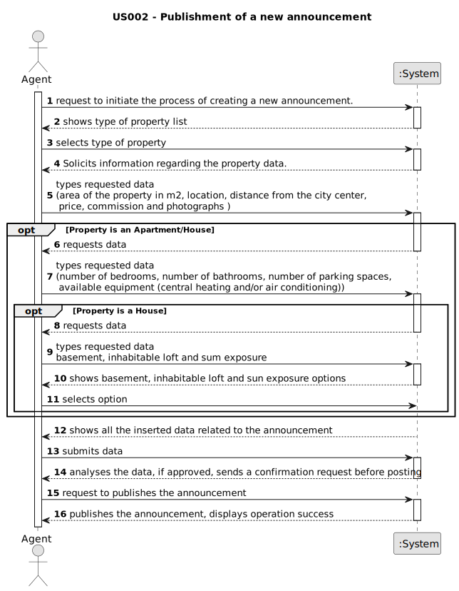

# US 007

## 1. Requirements Engineering
	
### 1.1. User Story Description

As an organization employee, I want to create a new task in order to be further published.

### 1.2. Customer Specifications and Clarifications 

**From the specifications document:**

>Each property is part of a type: Land, Apartment or an House.

>Each property setted as Land is characterized by the area in m2, the location, the distance from the city centre, the requested price and one or more photographs.

>Each property setted as Apartment is characterized by all the characteristics of Land and the number of bedrooms, the number of bathrooms, the number of parking spaces and the available equipment, such as central heating and/or air conditioning.

>Each property setted as House is characterized by all the characteristics of Apartment and the existence of abasement, an inhabitable loft, and sun exposure.

>The real estate agent reviews advertisement requests, registers the information and sets the commission in the system and publishes the offer so that it is visible to all clients who visit the agency and use the application.

**From the client clarifications:**

> **Question:** when the request arrives at the agent, are all the essential characteristics of the property in question already present?
>  
> **Answer:** Yes.

> **Question:** What would be the attributes of the Owner and Agent?
>  
> **Answer:** The Owner attributes are: the name, the citizen's card number, the tax number, the address, the email address and the contact telephone number. The Agent is an employee of the company.

> **Question:** The act of publishing a sale announcement means that the agent is publishing a new property for sale in the system (receiving the information of the seller and publishing the new property for sale) or is it the buyer giving positive feedback to the agent with intent to buy the property(actually closing a sale, buying a property and de-listing said property)?
>
> **Answer:**  In US1 we get "As an agent, I can publish any sale announcement on the system, for example received through a phone call". Additional information related with this question is also avaliable in the project description. Asking the customer something that is clear or has already been clarified is unprofessional.

> **Question:** Is the phone call the only way the agent can receive the sale announcement? Or he can receive them via e-mail/ letter/ etc?
>
> **Answer:** For now this is the only way.

> **Question:** Is the comission an attribute of a sale or of an announcement?
>
> **Answer:** From my previous answers and from knowledge that the students obtained in the ESOFT course, each team should know the answer to this question.
Moreover, this type of question should not be put to the client. Typically the client is not an expert in software modeling and has a lot to do beyond the project.

> **Question:**  In one of the previous questions you have stated that for now the only way that a agent can receive the request to publish an announcement is through a phone call, however in the primary data necessary to create an announcement it's said that it's necessary to upload at least one photo of the property. Taking that into consideration, the announcement can't be fully made by only communicating with the owner through a phone call, how is it possible for an agent to publish an announcement without all the necessary data?
> 
> **Answer:** The owner can send the photograph by e-mail or any other means. The owner can even deliver the photograph to the store.

> **Question:** Another doubt that has emmerged is related to the identification of the owner of the property, isn't it required that the owner identifies themselves in the announcement?
>
> **Answer:** Info about the owner is not published.

> **Question:** In one of the previous questions you have stated that for now the only way that an agent can receive the sale announcement request is through a phone call. However, US004 states that "As an owner, I intend to submit a request for listing a property sale or rent, choosing the responsible agent". Isn't submitting a request for listing a property the same as a sale announcement request? If not, can you clarify?
>
> **Answer:** In my previous answer, when I said "...the only way that an agent can receive the sale announcement..." I was talking about the agent as an actor of the system that introduces in the system property data.

> **Question:** Also, since the only way that an agent can receive sale announcement request is through a phone call, wouldn't that contradict what was stated in the project description: "Owners go to one of the company's branches and meet with a real estate agent to sell or rent one or more properties, or they can use the company's application for the same purposes."?
>
> **Answer:** US2: As an agent, I can publish any sale announcement on the system, for example received through a phone call. For example...

### 1.3. Acceptance Criteria

* AC1: Only agents should be able to create announcements.
* AC2: All required information must be provided.
* AC3: Comissions can be a fixed amount or a percentage.

### 1.4. Found out Dependencies

* The data must be previously obtained.
* Has a dependency with US004

### 1.5 Input and Output Data

**Input Data:**

* Typed data:
	* Owners information: 
      * a name, 
      * a citizen's card number,
      * a tax number,
      * an address,
      * an email address 
      * a telephone number.
	
    * an area, 
    * location
    * the distance to the centre, 
    * a price, 
    * photos, 
    * the equipment available, 
    * number of bedrooms,
    * number of bathrooms,
    * number of parking spaces,
    * classifying commission type.
  
* Selected data:
  * if it has a basement,
  * if it has an inhabitable loft,
  * sun exposure.
  * classifying property category,
  * classifying commission type.

**Output Data:**

* Mock announcement with the information submitted
* (In)Success of the operation

### 1.6. System Sequence Diagram (SSD)

**Other alternatives might exist.**

#### Alternative One

### 1.7 Other Relevant Remarks