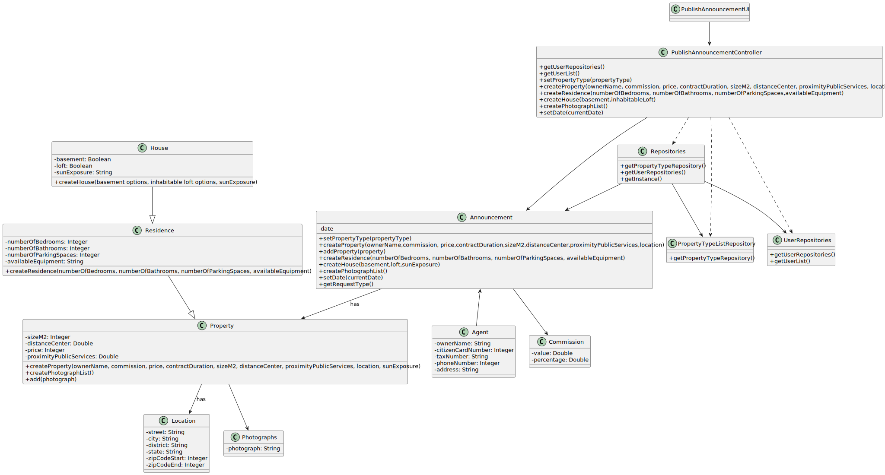

# US 002 

## 3. Design - User Story Realization 

### 3.1. Rationale

**SSD**

| Interaction ID                                                                                                                                                     | Question: Which class is responsible for...           | Answer                        | Justification (with patterns)                                                                                 |
|:-------------------------------------------------------------------------------------------------------------------------------------------------------------------|:------------------------------------------------------|:------------------------------|:--------------------------------------------------------------------------------------------------------------|
| Step 1: request to initiate the process of creating a new announcement. 		                                                                                         | 	... interacting with the actor?                      | PublishAnnouncementUI         | Pure Fabrication: there is no reason to assign this responsibility to any existing class in the Domain Model. |
| 			  		                                                                                                                                                            | 	... coordinating the US?                             | PublishAnnouncementController | Controller                                                                                                    |
| 			  		                                                                                                                                                            | 	... instantiating a new Task?                        | PublishAnnouncementUI         | Pure Fabrication                                                                                              |
| 			  		                                                                                                                                                            | ... requesting the agent to select an option?         | PublishAnnouncementUI         | Controller                                                                                                    |
| 			  		                                                                                                                                                            | ... obtaining the list of types of properties?							 | PropertyTypeListRepositories  | Information Expert                                                                                            |
| 			  		                                                                                                                                                            | ... saving the selected option?							                | PublishAnnouncementUI         | Pure Fabrication                                                                                              |
| Step 2: shows type of property list 		                                                                                                                             | ... requested the agent to input data?							         | PublishAnnouncementUI         | Pure Fabrication                                                                                              |
| Step 3: selects type of property 		                                                                                                                                | 	...validating the agent's input?                     | PublishAnnouncementUI         | Pure Fabrication                                                                                              |
| Step 4: Solicits information regarding the property data. 		                                                                                                       | 	...saving the input data?                            | PublishAnnouncementController | Controller                                                                                                    |
| Step 5: types requested data (area of the property in m2, location, distance from the city center, price, commission and photographs) 		                           | 	... requesting the agent to input data?              | PublishAnnouncementUI         | Pure Fabrication                                                                                              |
| Step 6: (option property is an apartment/house) requests data		                                                                                                    | ... validating the agent's input?							              | PublishAnnouncementUI         | Pure Fabrication                                                                                              |              
| Step 7: types requested data (number of bedrooms, number of bathrooms, number of parking spaces, available equipment (central heating and/or air conditioning)) 		 | 	... saving the input data?                           | PublishAnnouncementController | Controller                                                                                                    | 
| 			  		                                                                                                                                                            | 	... requesting the agent to select an option?        | PublishAnnouncementUI         | Pure Fabrication                                                                                              | 
| 			  		                                                                                                                                                            | 	... requesting to select an option?                  | PublishAnnouncementUI         | Pure Fabrication                                                                                              | 
| Step 8: (option property is a house) requests data	                                                                                                                | 	...obtaining the basement options?                   | House                         | Information Expert                                                                                            | 
| Step 9: types requested data basement, inhabitable loft and sun exposure 		                                                                                        | ... saving the input data?	                           | PublishAnnouncementController | Controller                                                                                                    | 
| Step 10: shows basement, inhabitable loft and sun exposure options 		                                                                                              | ...presenting the agent all the input data?	          | PublishAnnouncementController | Controller                                                                                                    | 
| Step 11: selects option 		                                                                                                                                         | 	... validating the agent's input?	                   | PublishAnnouncementUI         | Pure Fabrication                                                                                              | 
| Step 12: shows all the inserted data related to the announcement 		                                                                                                | ...presenting the agent all the input data?           | PublishAnnouncementUI         | Pure Fabrication                                                                                              |                                                                                                               |
| Step 13: submits data 		                                                                                                                                           | ... saving the input data?	                           | PublishAnnouncementController | Controller                                                                                                    | 
| Step 14: analyses the data, if approved, sends a confirmation request before posting 		                                                                            | ... validating the agent's input?	                    | PublishAnnouncementUI         | Pure Fabrication                                                                                              | 
| Step 15: request to publishes the announcement 		                                                                                                                  | ... requesting to select an option?	                  | PublishAnnouncementUI         | Pure Fabrication                                                                                              | 
| Step 16: publishes the announcement, displays operation success 		                                                                                                 | 	... sending success message?                         | PublishAnnouncementUI         | Pure Fabrication                                                                                              |

### Systematization ##

According to the taken rationale, the conceptual classes promoted to software classes are:

 * Repositories
 * PropertyTypeListRepository
 * House
 * Residence
 * Property
 * Location
 * Photographs
 * Agent
 * Commission
 * Announcement
 * UserRepositories

Other software classes (i.e. Pure Fabrication) identified: 

 * PublishAnnouncementUI  
 * PublishAnnouncementController

## 3.2. Sequence Diagram (SD)

### Full Diagram

This diagram shows the full sequence of interactions between the classes involved in the realization of this user story.

## 3.3. Class Diagram (CD)

