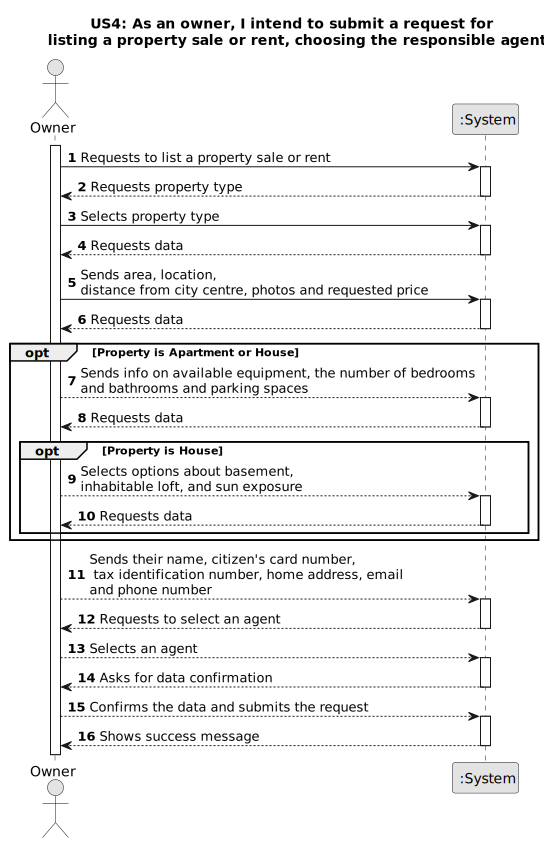

# US 004 - To Submit a request for listing a property sale or rent and choosing an agent 

## 1. Requirements Engineering

### 1.1. User Story Description

As a property owner I intend to submit a request for listing a property sale or rent and choosing an agent

### 1.2. Customer Specifications and Clarifications 

**From the specifications document:**

>	The property owner can get in touch with Real Estate USA to either sell or rent out their property. They can either visit one of the company's branches and speak with a real estate agent, or they can make use of the company's application. By using the app, the owner can input the characteristics of their property, along with the desired price and send the request to an agent. The owner will be required to provide information such as the property type (e.g. house, apartment), area in square meters, location, distance from the city center, requested price, and one or more photos. For apartments or houses, additional details such as the number of bedrooms, bathrooms, parking spaces, and available equipment like central heating and air conditioning must be provided. In the case of a house, the owner will also need to specify if there is a basement, inhabitable loft, and the direction of sun exposure (north, south, east, or west). exclusive to the employees of the respective organization. 

**From the client clarifications:**

> **Question:** Which is the unit of measurement used to estimate duration?
>  
> **Answer:** Duration is estimated in days.

> **Question:** Monetary data is expressed in any particular currency?
>  
> **Answer:** Monetary data (e.g. estimated cost of a task) is indicated in POTs (virtual currency internal to the platform).

> **Question:** If the owner doesn't select an agent will the platform randomly assign one or the request cannot move to revision? If not, must we assume that all information slots must be filled?
>
> **Answer:** When filling the property data, the owner should select one agent from the list of agents working in the selected agency. Moreover, the application should include a feature to randomly assign one agent. The address of the owner is not mandatory.

> **Question:** Do requests have any reference/code identifying them with any specific format? What about descriptions (any restrictions, like character limit)? Does that reference carry out with the advertisement?
>
> **Answer:** Please choose appropriate data formats for the request. You are a team of experts , and you should choose appropriate formats. In the next sprints I will specify some data formats.

> **Question:** When renting, does the owner have any space to clarify any prohibitions or obligations with the property?
>
> **Answer:** No.

> **Question:** Does the owner have a limit of requests they can do?
>
> **Answer:** No.

> **Question:** Regarding the property’s photographs, is that considered selected data?
>
> **Answer:** The owner should input the URI of each file/photograph.

> **Question:** In the case of listing a land property, shall the owner refer if there is a building permit already approved?
>
> **Answer:** No.

> **Question:**  According to the Project Description, the agent when selling a property can charge a flat price commission or a percentage of the sale value, my question here is whether there is a minimum and/or a maximum to each of these types of commissions?
>
>  **Answer:** There is no maximum and the minimum is 0.

> **Question:**  Does an owner need to be registered in the system to submit a request for a property listing?
> 
>  **Answer:** No. When making the request to list a property, the owner should introduce his own data. The Owner attributes are: the name, the citizen's card number, the tax number, the address, the email address and the telephone number.

> **Question:** When assigning an agent to a property listing, are the available agents shown by the system for the owner to pick? Or does the owner need to provide the agent's information (name, agency,etc)?
> 
> **Answer:** The owner should select one agent from a list of agents that work in the selected agency. The owner should select the agency before selecting the agent.

> **Question:**  Is there a designated currency for this business, or should we use USD?
> 
>  **Answer:** Please use USD

> **Question:** Should we consider that, until the request is reviewed and posted, the request stays in a "not published" state?
> 
> **Answer:** This is an implementation detail. For me, as a client, I want the feature implemented as I already described in the project description.

> **Question:** When publishing a property, if the owner leaves the listing unfinished, can it be saved or stay as a sketch to be finished later ?
> 
>  **Answer:** No.

>  **Question:** Is it possible to submit multiple listing for the same property and type of listing?
> 
> **Answer:** No.

### 1.3. Acceptance Criteria

* **AC1:** The owners must provide property's type, area, location, distance from city centre, photos and the desired price.
* **AC2:**  The user should specify if the property is for sale or rent.
* **AC3:** The same property can't be assigned to more than one agent.

### 1.4. Found out Dependencies

* There is a dependency on "US002" as the agents must be able to publish the listings.
*  The "US003 Register a new employee" feature is dependent on the existence of at least one agent, as an agent must be selected when registering a new employee.
* There is a dependency on US006, the System Administrator must specify locations so that the Owner can select them.

### 1.5 Input and Output Data

**Input Data:**

* Typed data:
	* area,
    * distance from the city centre,
    * price 
    * contract duration
    * photographs
    * number of bedrooms,
	* number of bathrooms,
    * number of parking spaces,
    * available equipment,
    * basement,
    * inhabitable loft,
    * sun exposure.
	
* Selected data:
	* type of business
    * agency
    * agent
    * type of property
    * location

**Output Data:**
* List of existing options (rent and sell)
* List of existing agencies
* List of existing agents
* List of existing types of properties
* (In)Success of the operation

* List of existing task categories
* (In)Success of the operation

### 1.6. System Sequence Diagram (SSD)

**Other alternatives might exist.**

#### Alternative One

### 1.7 Other Relevant Remarks

* 