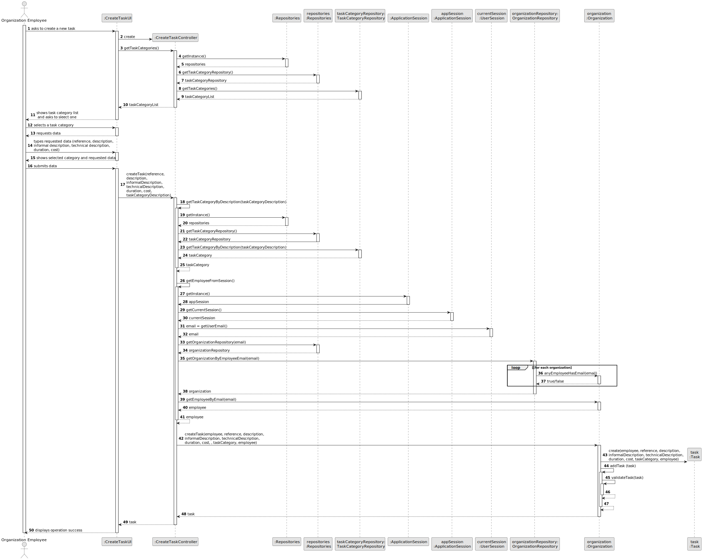
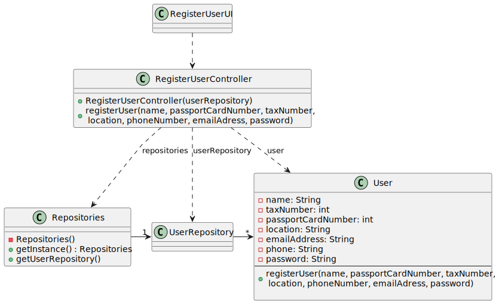

# US 006 - To create a Task 

## 3. Design - User Story Realization 

### 3.1. Rationale

**SSD - Alternative 1 is adopted.**

| Interaction ID | Question: Which class is responsible for...   | Answer                 | Justification (with patterns)                                                                                 |
|:---------------|:----------------------------------------------|:-----------------------|:--------------------------------------------------------------------------------------------------------------|
| Step 1  		     | 	... interacting with the unresgistered user? | RegisterUserUI         | Pure Fabrication: there is no reason to assign this responsibility to any existing class in the Domain Model. |
| 			  		        | 	... coordinating the US?                     | RegisterUserController | Controller                                                                                                    |
| 			  		        | 	... acessing the repositories?						         | RegisterUserController | Pure Fabrication                                                                                              |
| Step 2  		     | 	... requesting data?						                   | RegisterUserUI         | Pure Fabrication                                                                                              |
| Step 3  		     | 	... types requested data?                    | RegisterUserUI         | Pure Fabrication                                                                                              |
| Step 4  		     | 	... shows account information?               | RegisterUserUI         | Pure Fabrication                                                                                              |
| Step 5  		     | 	... submits data?                            | RegisterUserUI         | Pure Fabrication                                                                                              |
| Step 6  		     | 	... displays operation success?					         | RegisterUserUI         | Pure Fabrication                                                                                              |

### Systematization ##

According to the taken rationale, the conceptual classes promoted to software classes are: 

 * Repositories
 * UserRepository
 * User

Other software classes (i.e. Pure Fabrication) identified: 

 * RegisterUserUI  
 * RegisterUserController

## 3.2. Sequence Diagram (SD)

### Alternative 1 - Full Diagram

This diagram shows the full sequence of interactions between the classes involved in the realization of this user story.

## 3.3. Class Diagram (CD)

