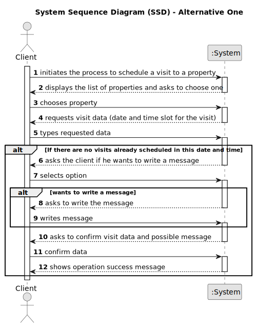

# US 006 - To create a Task 

## 1. Requirements Engineering

### 1.1. User Story Description

As a client, I want to leave a message to the agent to schedule a visit to a property of my interest.

### 1.2. Customer Specifications and Clarifications 

**From the specifications document:**

>	Each task is characterized by having a unique reference per organization, a designation, 
an informal and a technical description, an estimated duration and cost as well as the its 
classifying task category. 

>	As long as it is not published, access to the task is exclusive to the employees of the respective 
organization. 

**From the client clarifications:**

> **Question:** Does the client provide (by typing) their name and phone number for the message, 
regardless of whether that information is already available to the system?
>  
> **Answer:** The information available in the system should be used. 
The client does not need to type the name and phone number.

> **Question:** Is all the required data for the message typed, or is any of it selected?
>  
> **Answer:** For now the information should be typed.

> **Question:** Can the customer visit the same property more than once?
>
> **Answer:** A client may post multiple visit requests, but only if those do not overlap each other. 
In this US the client is only scheduling a visit to a property. In the beginning of Sprint D we will 
introduce more USs.

> **Question:** On US9 AC1 it is says: "AC1. A list of available properties must be shown, sorted from the 
most recent entries to the oldest." Does this mean that we can only have the option to make contact in this 
type of sort?
>
> **Answer:** No. AC1 is the default sorting method.

> **Question:** When we list in another way, should not be possible to have the option to schedule a visit?
>
> **Answer:** After sorting the properties, the client can still schedule a visit.

> **Question:** Assuming that this is done so the client can see the available properties in order to select 
one and given that in a previous question you've stated that the required information for the message should be 
typed then, for this US, is the only selected data the property that the client wishes to visit?
>
> **Answer:** System behavior must be consistent.For instance, the filters to be applied when the client 
is viewing a list of properties should be similar to the filters used in US1.

> **Question:** Can the client make multiple schedules in a single message for different properties, or can 
they only have 1 property per message with multiple schedules?
>
> **Answer:** The client can only schedule a visit to one property at a time.Each time the client schedules 
a visit, the client should specify, for each day, one or multiple time slots.The time slots should not overlap.
If the client wants to visit more properties, the client should use/run again the visit scheduling feature 
available in the system.

> **Question:** When writing the information to schedule a meeting with the agent, the preferred date and 
the time slot of the visit should be checked.The client can choose any day of the year?And any time of the day?
>
> **Answer:** Any date and time can be specified. We are always available to our customers!

> **Question:** The client can make multiple schedules in a single message?
>
> **Answer:**  Every time the client makes use of this feature of the system, the client can specify 
multiple date/time slots.

> **Question:**  In AC2, when the suggestion of date and time is sent, is there a standard duration for the 
visit or is it mandatory to fill in a start time and an end time for the visit?
>
> **Answer:** There is no standard duration to schedule a visit. The client should define his availability 
specifying the start time and the end time for the visit.

> **Question:** In AC2, can any time be used or are we limited to certain hours?
>
> **Answer:** Any time can be used.

> **Question:** Also in AC2, should we use the 12am/pm or 24-hour time format?
>
> **Answer:** Please use 24-hour time format.

> **Question:**
>
> **Answer:**

### 1.3. Acceptance Criteria

* **AC1:** A list of available properties must be shown, sorted from the most recent
  entries to the oldest.

* **AC2:** The message must also include the client's name, phone number,
  preferred date and time slot (from x hour to y hour) for the property visit

* **AC3:** A client may post multiple visit requests, but only if those do not overlap
  each other

* **AC4:** The client must receive a success message when the request is valid and
  registered in the system

### 1.4. Found out Dependencies

* There is a dependency to "US003 Create a task category" since at least a task category must exist to classify the task being created.

### 1.5 Input and Output Data

**Input Data:**

* Typed data:
	* date of the visit 
	* time slot of the visit 
	* Message for the agent
	
* Selected data:
	* Property to visit
    * Leave a message
    * confirmation options

**Output Data:**

* List of properties
* Success of the operation

### 1.6. System Sequence Diagram (SSD)

**Other alternatives might exist.**

### 1.7 Other Relevant Remarks

* The created task stays in a "not published" state in order to distinguish from "published" tasks.