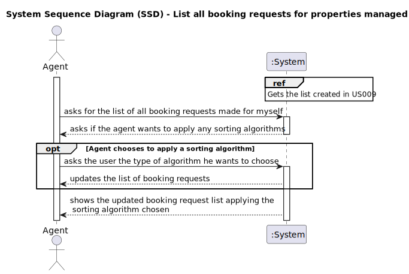

# US 015 

## 1. Requirements Engineering

### 1.1. User Story Description
As an agent, I intend to list all booking requests for properties managed by me.

### 1.2. Customer Specifications and Clarifications

**From the specifications document:**

The client can request to schedule a visit to the real estate agent for a specific property to verify its conditions.

The agent intends to receive the request, check its availability and send a response.

If the customer accepts the order, it is automatically scheduled in the system.

After carrying out the visit, the agent records the visit and an indication of whether or not he thinks the deal will take place.

**From the client clarifications:**

> **Question:** US015 - Clarifications on a previous question (Friday, 2 de June de 2023)
>US017's AC2 states that "Two sorting algorithms should be implemented (to be chosen manually by the network manager)."
US015's AC2 states that "The list of requests must be sorted by date in ascending order. The sorting algorithm to be used by the application must be defined through a configuration file. At least two sorting algorithms should be available."
As such, the team would like to know if, just like in US017, the sorting methods would be chosen manually in US015.
> **Answer:**  In US 15 the sorting algorithm to be used by the application must be defined through a configuration file. 
This is a different strategy from what I want in US17.

> **Question:** US015 - clarifications on AC1 (Thursday, 1 de June de 2023)
> In US015's AC1, it is stated that "The list of requests must be shown for a specific period (begin date, end date)."
This time period caused confusion, as the team is unsure whether the "date" is referring to the date chosen by the client
in the message (See US009's requirements) or the date of creation of the visit request.
> **Answer:** The goal is to use the date chosen by the client (the preferred date that you can see in US9) to list booking requests.

> **Question:** US015 - Sorting Algorithms (Tuesday, 30 de May de 2023)
>US015's AC2 states that "The list of requests must be sorted by date in ascending order. The sorting algorithm to be used 
by the application must be defined through a configuration file. At least two sorting algorithms should be available."
As such, the team would like to know if this requirement will be part of the user's interaction with this US, or if it's 
just there for flexibility purposes. By that we mean to ask if the client will be able to chose which sorting method they want to apply,
even if the end result will always be the same, or if we will provide those methods but chose which one is actually going to sort the list, 
without the client's awareness, as all they did was ask to see the list and the program showed them the end result.
>If we are to chose which one of the methods will be used, should we chose the most efficient one? It seems like
a no brainer question, but we would still like to make sure we are following your vision for the program.
> **Answer:** The sorting algorithm to use should be defined in a configuration file.

> **Question:** US015 - Clarifications (Thursday, 1 de June de 2023)
>  Booking is a slightly vague word. Our team wants clarifications on what type of requests the word encompasses 
(visit requests being our strongest guess, but we are not sure).
> **Answer:** It is a visit request.

> **Question:** US015 - Typed and selected data (Thursday, 1 de June de 2023)
>  US015's AC1 states that "The list of requests must be shown for a specific period (begin date, end date)".
As such, our team would like to know if you want this time period to be selected or typed, and in which format it should be in.
> **Answer:** The dates should be selected. The format should be DD-MM-YYYY.

### 1.3. Acceptance Criteria

* **AC1:** The list of requests must be shown for a specific period (begin date, end date).
* **AC2:** The list of requests must be sorted by date in ascending order. The sorting algorithm to be used by the
application must be defined through a configuration file. At least two sorting algorithms should be available.
* **AC3:** The list of requests must come from a client that wants to verify the conditions of a property.
* **AC4:** The agent should have at least two sorting algorithms available for listing of the booking requests.
* **AC5:** The sorting algorithm used by the application should be configurable through a configuration file.
* **AC6:** The application should accurately retrieve and display the booking requests that correspond to the properties
managed by the agent for the specified period.

### 1.4. Found out Dependencies

There is a dependency with the "US09" because in that US the client leaves a message for the agent, that will be 
reviewed by the agent in this US.

There is also a dependency with the "US16", because upon reviewing the message in this US, the agent will send a 
response to the user.

There is also a dependency with the "US20", because after the agent sends the message about the request to the user, 
the client must be able to accept it or reject it.

### 1.5 Input and Output Data

**Input Data:**

* Typed data:
    * The type of sorting algorithm chosen.
	
* Selected data:
  * List of all requests made to the agent logged on.
  * The list of all requested visits for the agent logged on, sorted by the chosen sorting method.

**Output Data:**

* (In)Success of the operation
* The list of all requested visits for the agent logged on, sorted by the chosen sorting method.

### 1.6. System Sequence Diagram (SSD)

#### Alternative One

### 1.7 Other Relevant Remarks

* The list of requests must be shown in a specific time period.