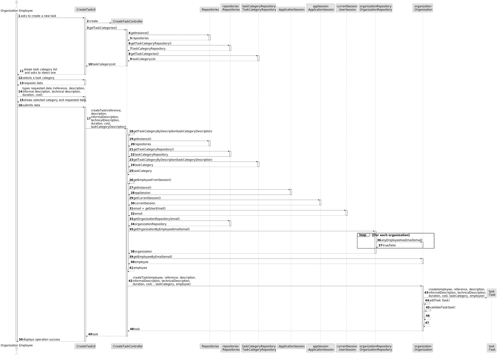

# US 0015

## 3. Design - User Story Realization 

### 3.1. Rationale

**SSD - Alternative 1 is adopted.**

| Interaction ID                                                                                                    | Question: Which class is responsible for...   | Answer               | Justification (with patterns)                                                                                 |
|:------------------------------------------------------------------------------------------------------------------|:----------------------------------------------|:---------------------|:--------------------------------------------------------------------------------------------------------------|
| Step 1: asks for the list of all booking requests made for myself  		                                             | 	... interacting with the actor?              | CreateEmployeeUI     | Pure Fabrication: there is no reason to assign this responsibility to any existing class in the Domain Model. |
| 			  		                                                                                                           | 	... coordinating the US?                     | CreateTaskController | Controller                                                                                                    |
| 			  		                                                                                                           | 	... instantiating a new Task?                | Organization         | Creator (Rule 1): in the DM Organization has a Task.                                                          |
| 			  		                                                                                                           | ... knowing the user using the system?        | UserSession          | IE: cf. A&A component documentation.                                                                          |
| 			  		                                                                                                           | 							                                       | Organization         | IE: knows/has its own Employees                                                                               |
| 			  		                                                                                                           | 							                                       | Employee             | IE: knows its own data (e.g. email)                                                                           |
| Step 2: asks if the agent wants to apply any sorting algorithms  		                                               | 							                                       |                      |                                                                                                               |
| Step 3: asks the user the type of algorithm he wants to choose  		                                                | 	...saving the inputted data?                 | Task                 | IE: object created in step 1 has its own data.                                                                |
| Step 4: chooses the algorithm  		                                                                                 | 	...knowing the task categories to show?      | System               | IE: Task Categories are defined by the Administrators.                                                        |
| Step 5: updates the list of booking requests  		                                                                  | 	... saving the selected category?            | Task                 | IE: object created in step 1 is classified in one Category.                                                   |
| Step 6: shows the updated booking request list applying the \n sorting algorithm chosen and operation success  		 | 							                                       |                      |                                                                                                               |

### Systematization ##

According to the taken rationale, the conceptual classes promoted to software classes are: 

 * Organization
 * Task

Other software classes (i.e. Pure Fabrication) identified: 

 * CreateTaskUI  
 * CreateTaskController

## 3.2. Sequence Diagram (SD)

This diagram shows the full sequence of interactions between the classes involved in the realization of this user story.

## 3.3. Class Diagram (CD)

