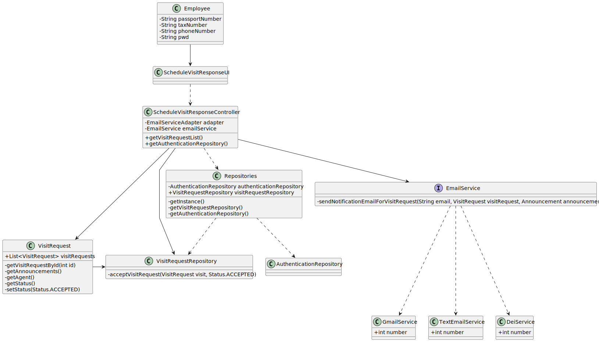

# US 006 - To create a Task 

## 3. Design - User Story Realization 

### 3.1. Rationale

**SSD - Alternative 1 is adopted.**

| Interaction ID | Question: Which class is responsible for...                               | Answer                          | Justification (with patterns)                                                                                 |
|:---------------|:--------------------------------------------------------------------------|:--------------------------------|:--------------------------------------------------------------------------------------------------------------|
| Step 1  		     | 	... interacting with the actor?                                          | ScheduleVisitResponseUI         | Pure Fabrication: there is no reason to assign this responsibility to any existing class in the Domain Model. |
| 			  		        | 	... coordinating the US?                                                 | ScheduleVisitResponseController | Controller                                                                                                    |
| 			  		        | ... knowing the user using the system?                                    | UserSession                     | IE: cf.A&A component documentation                                                                            |
| 			  		        |                                                                           | User                            | IE: knows its own data(e.g. email)                                                                            |         
| 		Step 2 	  		 | 		... getting the id from the visit request?					                         | VisitRequestRepository          | IE: knowns all visits request                                                                                 |
| 		Step 3 	  		 | 		...saving the visit request selected?					                              | ScheduleVisitResponseController | Controller                                                                                                    |
| 	Step 4 	      | 		...displaying the visit selected?					                                  | ScheduleVisitResponseUI         | IE: is responsible to display the booking request to the agent                                                |
| 	Step 5	       | 	...validating all data?                                                  | ScheduleVisitResponseController | Controller                                                                                                    |
| 		             | 	...for accepting or decline the visit?                                   | ScheduleVisitResponseController | Controller : is responsible for knowing if it was accepted or decline                                         |
| 		             | 	... to know what email platform is the notification going to be sent by? | EmailServiceAdapter             | IE: it is responsible to read the configuration file                                                          |
| 		             | 		...sending and saving the email notification					                       | TextEmailService                | IE: is responsible to send the email                                                                          |              
| Step 6  		     | 	... informing operation sucess                                           |    ScheduleVisitResponseUI                          | IE: is responsible for user interactions                                                                      | 

### Systematization ##

 * Announcement
 * VisitRequest
 * Repositories

Other software classes (i.e. Pure Fabrication) identified: 

 * ScheduleVisitResponseUI  
 * ScheduleVisitResponseController

## 3.2. Sequence Diagram (SD)

### Alternative 1 - Full Diagram

This diagram shows the full sequence of interactions between the classes involved in the realization of this user story.

## 3.3. Class Diagram (CD)

