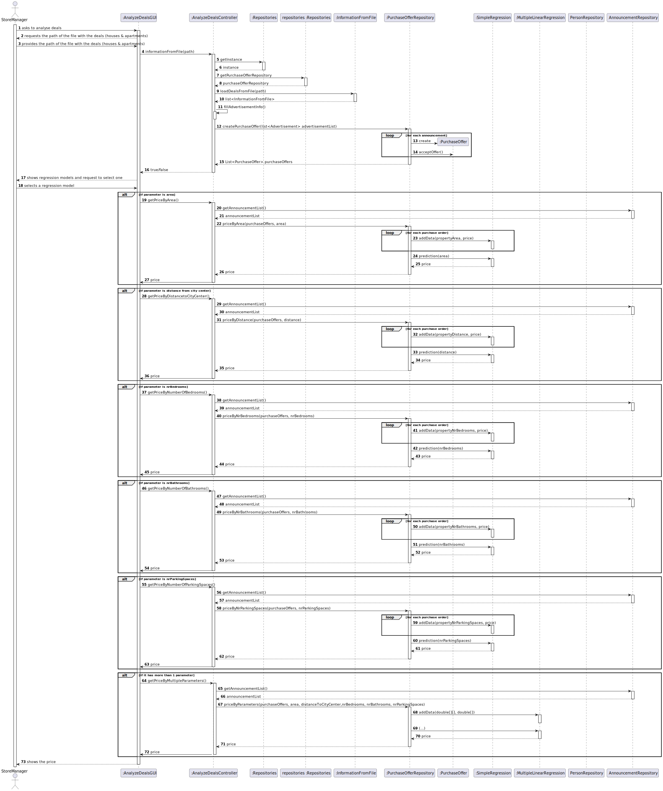
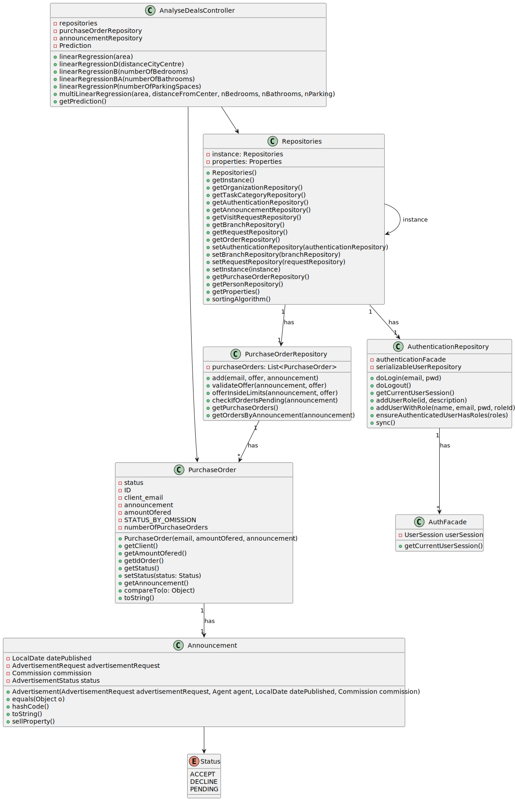

# US 0018 

## 3. Design - User Story Realization 

### 3.1. Rationale

**SSD - Alternative 1 is adopted.**

| Interaction ID | Question: Which class is responsible for...                   | Answer                 | Justification (with patterns)                                                                           |
|:---------------|:--------------------------------------------------------------|:-----------------------|:--------------------------------------------------------------------------------------------------------|
| Step 1  		     | 	... interacting with the actor?                              | StoreManager           | Pure fabrication: Represents the actor (Store Manager) interacting with the system.                     |
| Step 2  		     | 	... coordinating the US?						                               | AnalyzeDealsController | Controller: Handles the coordination and business logic related to analyzing deals.                     |
| Step 3  		     | 	... getting the chosen file from the user?                   | AnalyzeDealsUI         | Pure fabrication: Responsible for handling user interactions related to analyzing deals.                |
| Step 4  		     | 	... accessing repositories in the system?                    | Repositories           | Information Expert: Represents a collection of repositories responsible for data access and management. |
| Step 5  		     | 	... getting the LegacySystemRepository?                      | Repositories           | 	Information Expert: Responsible for accessing and managing legacy system-related data.                 |
| Step 6  		     | 	... getting the AnalyzeAllDeals instance?					               | Repositories           | Information Expert: Responsible for accessing and managing instances of AnalyzeAllDeals.                |              
| Step 7  		     | 	... getting the chosen file from the LegacySystemRepository? | LegacySystemRepository | Information Expert: Responsible for accessing and managing files from the legacy system.                | 
| Step 8  		     | 	... performing Simple Linear Regression?                     | AnalyzeAllDeals        | 	Pure fabrication: Represents the entity responsible for performing Simple Linear Regression.           | 
| Step 9  		     | 	... performing Multiple Linear Regression?                   | AnalyzeAllDeals        | Pure fabrication: Represents the entity responsible for performing Multiple Linear Regression.          | 
| Step 10  		    | 	... providing information and statistics to the user?        | AnalyzeAllDeals        | Pure fabrication: Responsible for displaying information and statistics to the user.                    | 

### Systematization ##

According to the taken rationale, the conceptual classes promoted to software classes are:
* LegacySystemRepository

Other software classes (i.e. Pure Fabrication) identified:
* Repositories
* AnalyzeDealsGUI
* AnalyzeDealsController

## 3.2. Sequence Diagram (SD)
This diagram shows the full sequence of interactions between the classes involved in the realization of this user story.

## 3.3. Class Diagram (CD)

