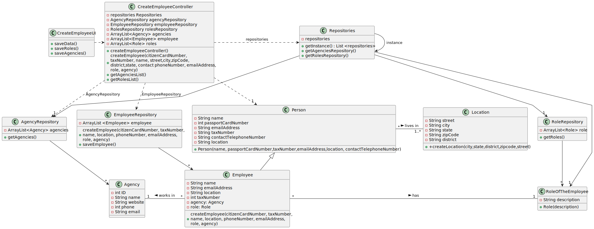

# US 003 

## 3. Design - User Story Realization 

### 3.1. Rationale

**SSD - Alternative 1 is adopted.**

| Interaction ID                                                                                                                                                           | Question: Which class is responsible for...                         | Answer                   | Justification (with patterns)                                                                                 |
|:-------------------------------------------------------------------------------------------------------------------------------------------------------------------------|:--------------------------------------------------------------------|:-------------------------|:--------------------------------------------------------------------------------------------------------------|
| Step 1: The system administrator asks to to initiate the process of registering a new employee  		                                                                       | ... instantiate the controller?                                     | CreateEmployeeUI         | Pure Fabrication: there is no reason to assign this responsibility to any existing class in the Domain Model. |
|                                                                                                                                                                          | ...Coordinating the US?                                             | CreateEmployeeController | Controller                                                                                                    |
| Step 2: solicits information regarding employee data(name, passport card number,\ntax number, street, district,zipcode,city,state,email adress,contact telephone number) | ...solicits the information about the actor?                        | CreateEmployeeUI         | Pure Fabrication                                                                                              |
| Step 3: types the employee information                                                                                                                                   | ...validate the typed information of the actor?		                   | CreateEmployeeUI         | Pure Fabrication                                                                                              |              
| 		                                                                                                                                                                       | ...saving the input data?                                           | CreateEmployeeUI         | Information Expert                                                                                            | 
| Step 4: shows the list of the roles that the new employee can perfor                                                                                                     | ... solicits the actor to select an option?                         | CreateEmployeeUI         | Pure Fabrication                                                                                              | 
|  Step 5: selects a role                                                                                                                                                  | ... obtain the list of roles?                                       | RoleRepository           |    Information Expert                                                                                   | 
| 			  		                                                                                                                                                                  |  ...save the selection?                                             | RegisterEmployeeUI       |   Information Expert                                                                                                     | 
| Step 6: shows the agencies list and ask to select the intended ones                                                                                                      | ...obtain the list of agencies?                                     | AgencyRepository         |   Information Expert                                                                                            |
|                                                                                                                                                                          | ...solicits the actor to select an option?                          | RegisterEmployeeUI       | Pure Fabrication                                                                                              |
| Step 7: selects an agency/agencies                                                                                                                                       | ...save the selection?                                              | RegisterEmployeeUI       |   Information Expert                                                                                            |
| Step 8:	shows all the information and asks to confirm                                                                                                                    | ... solicits the actor to confirm all the information?              | RegisterEmployeeUI       | Pure Fabrication                                                                                              |
| Step 9: confirm the information and submits data                                                                                                                         | ... save the information of the employee?                           | Agency                   | Creator                                                                                                       |
| Step 10: display operation sucess                                                                                                                                        | ... informing operation success?                                    | RegisterEmployeeUI       | Pure Fabrication                                                                                              |
 

### Systematization ##

According to the taken rationale, the conceptual classes promoted to software classes are: 

 * Person
 * Location
 * Agency
 * Employee
 * RoleOfTheEmployee
 * AgencyRepository
 * RoleRepository
 * EmployeeRepository 

Other software classes (i.e. Pure Fabrication) identified: 

 * CreateEmployeeUI  
 * CreateEmployeeController

## 3.2. Sequence Diagram (SD)

### Alternative 1 - Full Diagram

## 3.3. Class Diagram (CD)

