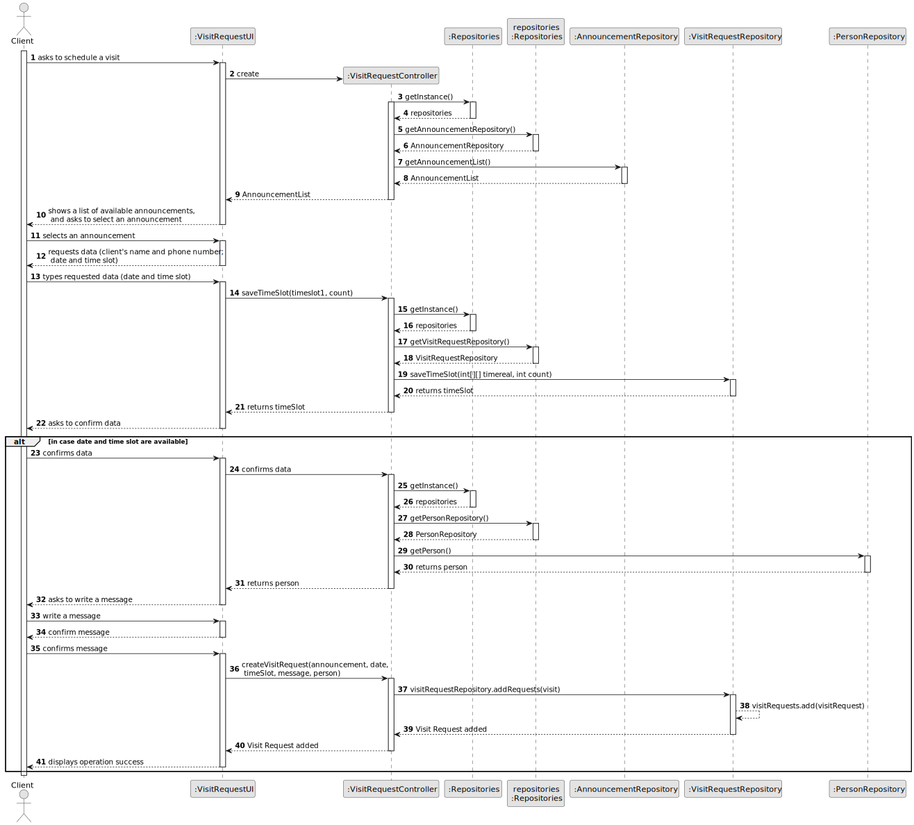
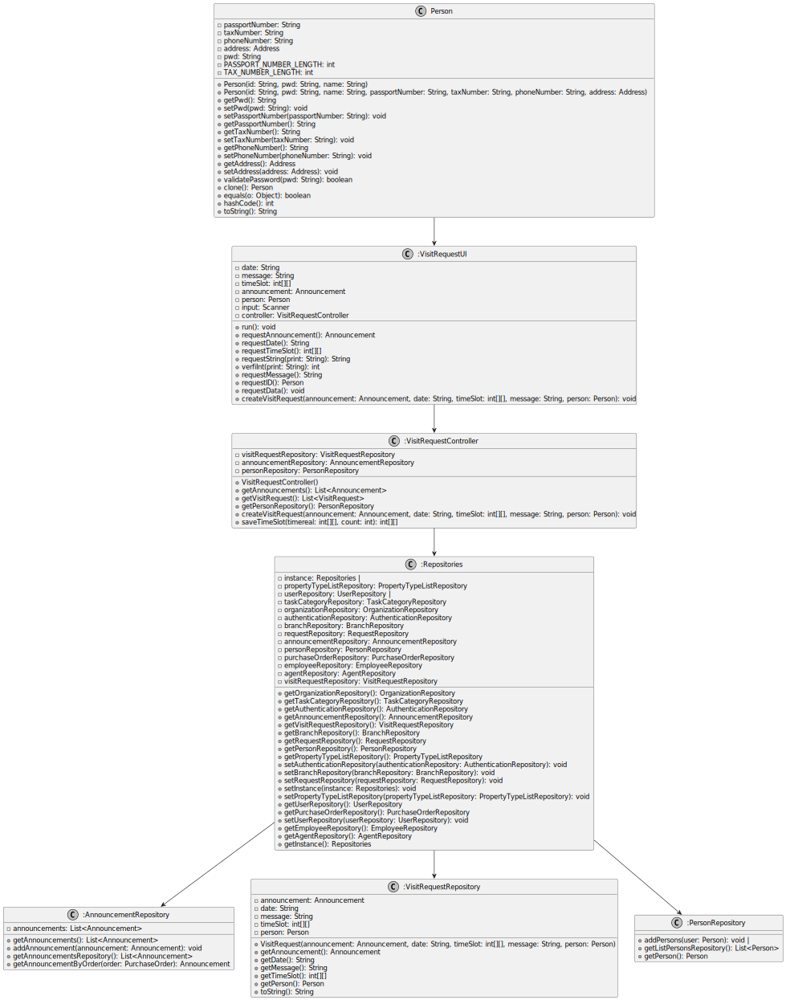

# US 006 - To create a Task 

## 3. Design - User Story Realization 

### 3.1. Rationale

**SSD - Alternative 1 is adopted.**

| Interaction ID                                                                                                                       | Question: Which class is responsible for...   | Answer               | Justification (with patterns)                                                                                 |
|:-------------------------------------------------------------------------------------------------------------------------------------|:----------------------------------------------|:---------------------|:--------------------------------------------------------------------------------------------------------------|
| Step 1: initiates the process to schedule a visit to a property  		                                                                  | 	... interacting with the actor?              | CreateEmployeeUI     | Pure Fabrication: there is no reason to assign this responsibility to any existing class in the Domain Model. |
| 			  		                                                                                                                              | 	... coordinating the US?                     | CreateTaskController | Controller                                                                                                    |
| 			  		                                                                                                                              | 	... instantiating a new Task?                | Organization         | Creator (Rule 1): in the DM Organization has a Task.                                                          |
| 			  		                                                                                                                              | ... knowing the user using the system?        | UserSession          | IE: cf. A&A component documentation.                                                                          |
| 			  		                                                                                                                              | 							                                       | Organization         | IE: knows/has its own Employees                                                                               |
| 			  		                                                                                                                              | 							                                       | Employee             | IE: knows its own data (e.g. email)                                                                           |
| Step 2: displays the list of properties and asks to choose one  		                                                                   | 							                                       |                      |                                                                                                               |
| Step 3: chooses property  		                                                                                                         | 	...saving the inputted data?                 | Task                 | IE: object created in step 1 has its own data.                                                                |
| Step 4: requests visit data (date and time slot for the visit)  		                                                                   | 	...knowing the task categories to show?      | System               | IE: Task Categories are defined by the Administrators.                                                        |
| Step 5: types requested data  		                                                                                                     | 	... saving the selected category?            | Task                 | IE: object created in step 1 is classified in one Category.                                                   |
| Step 6: [option 1 If there are no visits already scheduled in this date and time] asks the client if he wants to write a message  		 | 							                                       |                      |                                                                                                               |              
| Step 7: selects option  		                                                                                                           | 	... validating all data (local validation)?  | Task                 | IE: owns its data.                                                                                            | 
| 			  		                                                                                                                              | 	... validating all data (global validation)? | Organization         | IE: knows all its tasks.                                                                                      | 
| 			  		                                                                                                                              | 	... saving the created task?                 | Organization         | IE: owns all its tasks.                                                                                       | 
| Step 8: [option 2 wants to write a message] asks to write the message  		                                                            | 	... informing operation success?             | CreateTaskUI         | IE: is responsible for user interactions.                                                                     | 
| Step 9: writes message 		                                                                                                            | 	... informing operation success?             | CreateTaskUI         | IE: is responsible for user interactions.                                                                     | 
| Step 10: [end option 1] asks to confirm visit data and possible message                                                              | 	... informing operation success?             | CreateTaskUI         | IE: is responsible for user interactions.                                                                     | 
| Step 11: confirm data  		                                                                                                            | 	... informing operation success?             | CreateTaskUI         | IE: is responsible for user interactions.                                                                     | 
| Step 12: [end option 2] shows operation success message		                                                                            | 	... informing operation success?             | CreateTaskUI         | IE: is responsible for user interactions.                                                                     | 

### Systematization ##

According to the taken rationale, the conceptual classes promoted to software classes are: 

 * Organization
 * Task

Other software classes (i.e. Pure Fabrication) identified: 

 * VisitRequestUI  
 * VisitRequestController

## 3.2. Sequence Diagram (SD)

### Full Diagram

This diagram shows the full sequence of interactions between the classes involved in the realization of this user story.

## 3.3. Class Diagram (CD)

